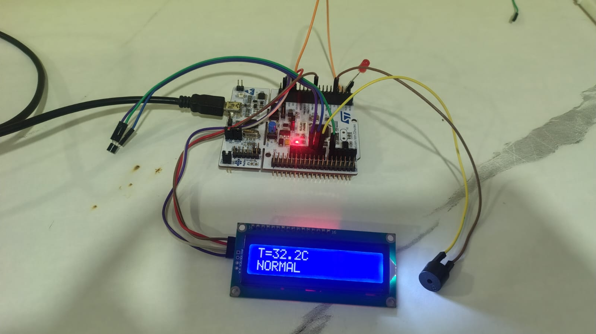
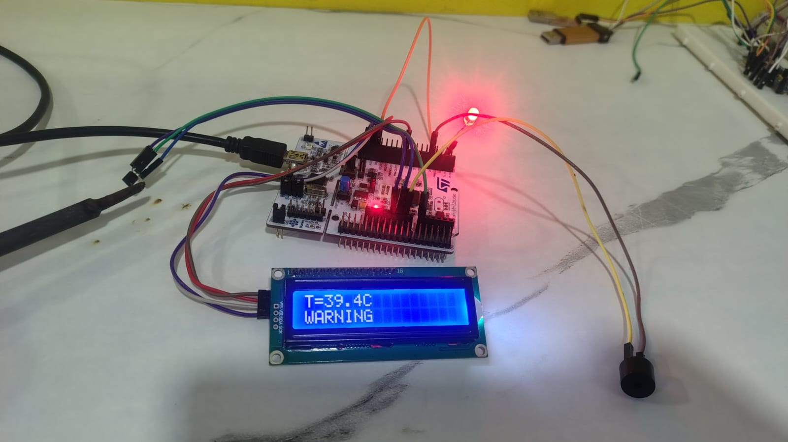
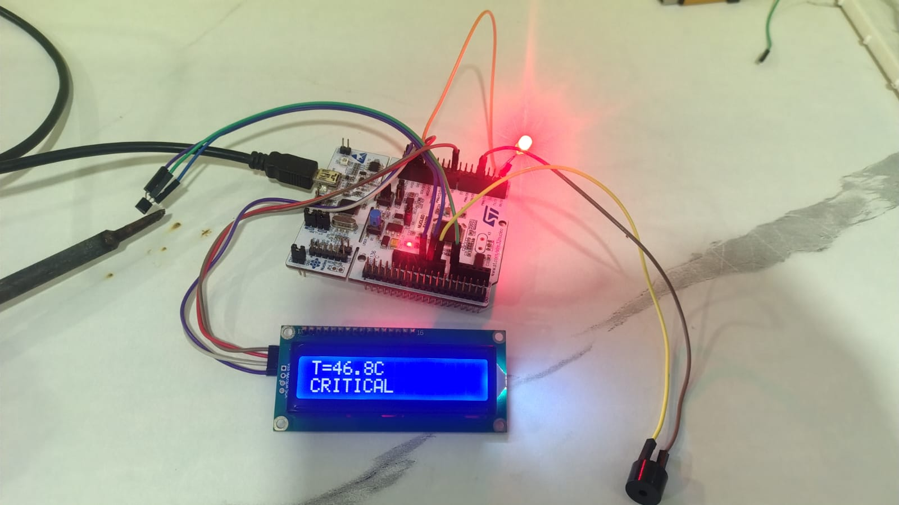
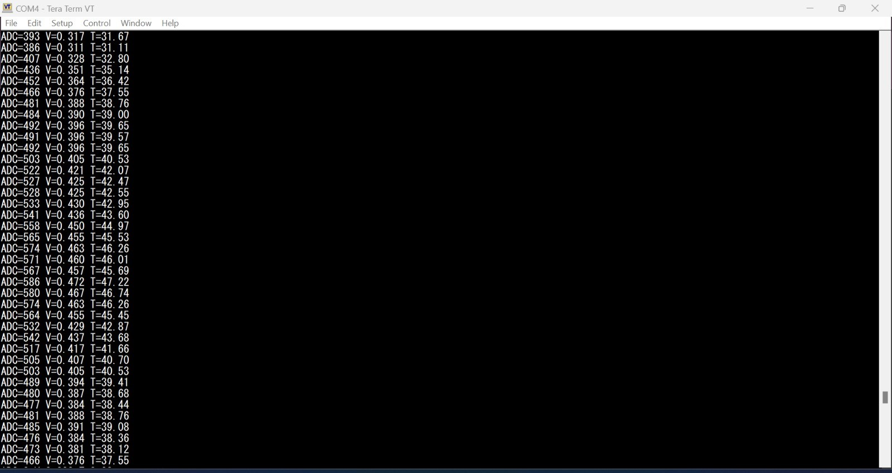

# Real-Time Temperature Monitoring System Using STM32 Nucleo and FreeRTOS

## Overview

This project implements a Real-Time Temperature Monitoring System using the STM32 Nucleo-F446RE development board and FreeRTOS.

The system continuously reads temperature data from an LM35 temperature sensor through the ADC peripheral and distributes the acquired data across multiple FreeRTOS tasks using Queues, Mutexes, Event Groups, and Task Notifications.

Temperature information is:

- Displayed on an I2C 16x2 LCD
- Sent to a PC through UART
- Used to generate warning and critical alarms using an LED and Buzzer

The project demonstrates practical implementation of multitasking, synchronization, and inter-task communication in FreeRTOS.

---

## Features

- LM35 Temperature Sensor Interfacing
- ADC Data Acquisition
- I2C LCD Temperature Display
- UART Logging
- LED Warning Indication
- Buzzer Critical Alarm
- FreeRTOS Task Scheduling
- Queue-Based Communication
- Mutex Protection for Shared Data
- Event Group Status Management
- Task Notification Mechanism
- Priority-Based Task Execution

---
## Project Demonstration

### Normal State
Temperature = 32.2°C

- LCD displays NORMAL
- LED OFF
- Buzzer OFF



---

### Warning State
Temperature = 39.4°C

- LCD displays WARNING
- LED ON
- Buzzer OFF



---

### Critical State
Temperature = 46.8°C

- LCD displays CRITICAL
- LED ON
- Buzzer ON



## UART Monitoring Output

Real-time temperature, voltage, and ADC values transmitted through UART for monitoring and debugging.

- Continuous ADC acquisition
- Voltage calculation from ADC readings
- Temperature conversion and logging
- Serial monitoring using Tera Term



---


## Hardware Used

| Component | Description |
|------------|------------|
| STM32 Nucleo-F446RE | Main Controller |
| LM35 | Temperature Sensor |
| I2C LCD 16x2 | Temperature Display |
| LED | Warning Indicator |
| Buzzer | Critical Alarm |
| USB Cable | Programming & UART |

---

## Software Used

- STM32CubeIDE
- STM32 HAL Drivers
- FreeRTOS
- Embedded C

---

## RTOS Architecture

```text
                LM35 Sensor
                     |
                     v
              +-------------+
              | Sensor Task |
              +-------------+
                     |
          -----------------------
          |                     |
          v                     v

     Shared Data            Log Queue
      (Mutex)                  |
          |                    |
          v                    v

    +------------+      +-------------+
    |  LCD Task  |      | Logger Task |
    +------------+      +-------------+
                               |
                               v
                            UART

                     Event Groups
                           |
                           v

                    +-------------+
                    | Alarm Task  |
                    +-------------+
                           |
                   ----------------
                   |              |
                   v              v
                 LED           Buzzer
```

---

## FreeRTOS Objects Used

### Queue

Used for transferring temperature data from Sensor Task to Logger Task.

```c
LogQueue = xQueueCreate(10,sizeof(TempData_t));
```

---

### Mutex

Used to protect shared temperature data.

```c
TempMutex = xSemaphoreCreateMutex();
```

---

### Event Group

Used to represent system status.

```c
TEMP_NORMAL_BIT
TEMP_WARNING_BIT
TEMP_CRITICAL_BIT
```

---

### Task Notifications

Used to immediately wake up Alarm Task when warning or critical temperature occurs.

```c
xTaskNotifyGive(AlarmTaskHandle);
```

---

## Task Details

### Sensor Task

Priority: 3

Responsibilities:

- Read ADC value
- Convert ADC to Voltage
- Convert Voltage to Temperature
- Update shared data
- Send data to Queue
- Update Event Groups
- Notify Alarm Task

Execution Period:

```c
500 ms
```

---

### LCD Task

Priority: 2

Responsibilities:

- Read shared temperature data
- Display temperature on LCD
- Display system state:

```text
NORMAL
WARNING
CRITICAL
```

Execution Period:

```c
500 ms
```

---

### Logger Task

Priority: 1

Responsibilities:

- Receive data from Queue
- Send ADC value
- Send voltage
- Send temperature through UART

Example Output:

```text
ADC=327
V=0.264
T=26.40
```

---

### Alarm Task

Priority: 4 (Highest)

Responsibilities:

- Monitor Event Groups
- Control LED
- Control Buzzer

Behavior:

#### NORMAL

```text
LED OFF
Buzzer OFF
```

#### WARNING

```text
LED Blink
```

#### CRITICAL

```text
LED ON
Buzzer ON
```

---

## Temperature Levels

### Normal

```text
Temperature < 35°C
```

### Warning

```text
35°C ≤ Temperature < 45°C
```

### Critical

```text
Temperature ≥ 45°C
```

---

## Data Structure

```c
typedef struct
{
    uint16_t adc;
    float voltage;
    float temperature;
} TempData_t;
```

---

## Temperature Calculation

### ADC to Voltage

```c
voltage =
((float)adc * 3.3f) / 4095.0f;
```

### Voltage to Temperature

LM35 Output:

```text
10mV = 1°C
```

Formula:

```c
temperature = voltage * 100.0f;
```

---

## Peripheral Configuration

### ADC

| Parameter | Value |
|------------|---------|
| Resolution | 12-bit |
| Channel | ADC Channel 0 |
| Conversion | Single |

### UART

| Parameter | Value |
|------------|---------|
| Instance | USART2 |
| Baud Rate | 115200 |

### I2C

| Parameter | Value |
|------------|---------|
| Instance | I2C1 |
| Clock Speed | 100kHz |

---

## FreeRTOS APIs Used

### Task Management

```c
xTaskCreate()
vTaskStartScheduler()
vTaskDelay()
```

### Queue Management

```c
xQueueCreate()
xQueueSend()
xQueueReceive()
```

### Mutex

```c
xSemaphoreCreateMutex()
xSemaphoreTake()
xSemaphoreGive()
```

### Event Groups

```c
xEventGroupCreate()
xEventGroupSetBits()
xEventGroupClearBits()
xEventGroupGetBits()
```

### Task Notification

```c
xTaskNotifyGive()
ulTaskNotifyTake()
```

---

## Learning Outcomes

- FreeRTOS Multitasking
- Queue Communication
- Mutex Synchronization
- Event Group Management
- Task Notifications
- ADC Interfacing
- UART Communication
- I2C LCD Interfacing
- Embedded System Design
- Real-Time Monitoring Applications

---

## Future Improvements

- SD Card Data Logging
- ESP32 Wi-Fi Integration
- MQTT Cloud Monitoring
- Mobile Application Dashboard
- FreeRTOS Software Timers
- Low Power Operation

---

## Author

### Guni Reddy Charan Kumar Reddy

Electronics and Communication Engineering

Skills:
- Embedded C
- STM32
- FreeRTOS
- UART
- I2C
- ADC
- Embedded Systems
- IoT
